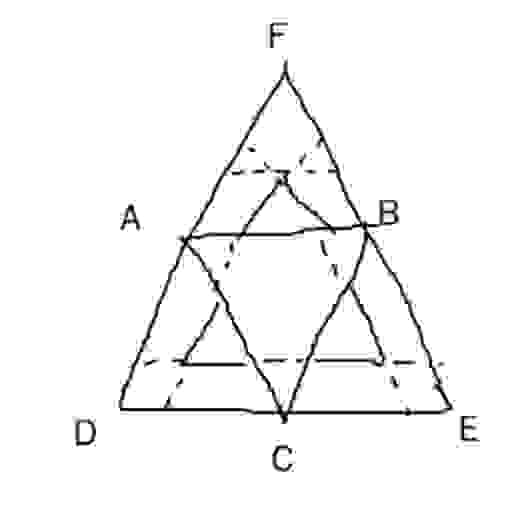

## 什么是Koch雪花

先设想一个三角形ABC，下面以AB边来说明计算方法，其它边方法一样。

将AB三等分，这里将等分点标记为D，E。以D，E为圆心，长度DE为半径，得到两个圆。这两个圆的交点中，取在多边形ABC的外部的那一个点，此点标记为F，另外一个交点舍弃。连接FD和FE，抹除线段DE。

我们得到了一个不规则多边形ADFEBC。我们分别对线段AD，DF，FE，EB进行三等分，重复以上步骤，可以不断向细节处递归地将图形变出更多的边。无限次重复后的多边形就是Koch雪花。

## 如何判断点是否在Koch雪花的内部

### 基本思路

假设Koch雪花在三角形ABC上绘制。假如点X在其**外接**三角形DEF之外，那么此点一定在Koch雪花外部。假如点在ABC之内，那么它一定在Koch雪花内部。

假如点在DEF内部，同时不在ABC内部，那么需要分情况判断。

> 突然发现一个问题，这个判断能不能利用一个神经网络来实现呢？神经元的本质也是判断给定的点是否在直线的某一边的，所以应该是可以的。通过对点平移缩放，可以反复迭代细节。

显然，三个边的判断规则具有很大的相似性，所以这里多考虑一步：用极坐标，将原点放在ABC的中点，通过旋转轻松地将点应用到三个不同的边。